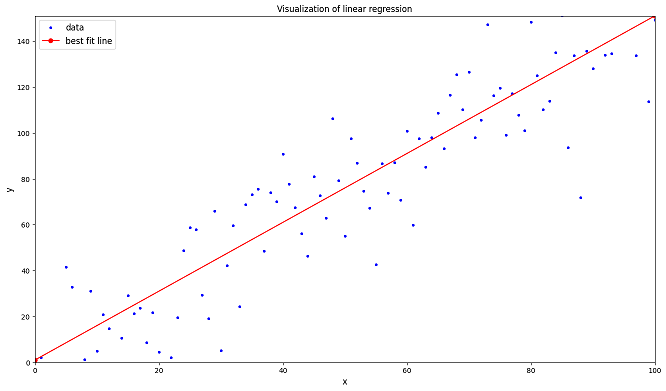

Our first lesson is a regression problem, where we try to predict the attendance rate for a school, based on a variety of input variables. The data we use here is open data from the public school districts in Connecticut, obtained from the [data.gov](https://catalog.data.gov/dataset/school-attendance-by-student-group-and-district-2022-2023) stie. 

This example uses what is perhaps the most simple ML model: a *Linear Regression* model. Conceptually, linear regression finds the best-fitting line through a collection of data points. Consider this plot, which you will see again in the lesson:

The blue points are fictitious data points, and the red line is the best fitting line through the points. In a linear regression ML model, the blue points would be the data we're using to make our predictions, and the red line would be the prediction. In the attendance rates example, we can't visualize the data this way, because it is in twenty-one dimensions rather than two, but the concept is still the same: find the best fitting line and use the equation of that line to make predictions. 

Like all of the lessons in the workshop, the instruction and the Python code for the lesson are all contained in a single [Google Colaboratory](https://colab.research.google.com/) Jupyter notebook. In order to use these lessons, you will need a Google account. 

To access the lesson, do the following:

1. [Click here](https://colab.research.google.com/drive/1lXzNblDbhHaOhh8bpcI6IkQaRr1PmTF9?usp=sharing){:target="_blank"} to open a new tab containing the lesson's Jupyter notebook.

2. If necessary, click on the "Sign In" button to log in to your Google account. 

3. Read the introductory text in the lesson, and follow the instructions in the notebook. 
