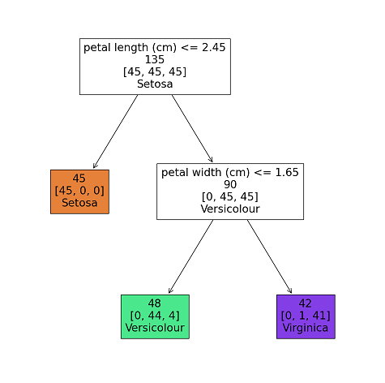

Our second lesson is a classification problem. In the lesson, we will train a computer to be able to tell us what species an iris is, based on measurements of its petal length and width. The example uses a famous dataset created by [Sir R. A. Fisher](https://dasl.datadescription.com/datafile/fishers-irises/) in 1936. 

This example uses a *decision tree classifier* ML model. After training, the model can classify instances -- irises, in this case -- as one of three species, by answering a short sequence of questions. Here is a visualization of the decision tree classifier that is created during the lesson:

This model uses two data measurements of an iris petal: the petal length and the petal width. Classification works from the top down in the diagram, and the arrows represent the answers to the questions in the white boxes, with the left arrow representing "true" and the right arrow representing "false." So, if we have a petal with a length less than or equal to 2.45cm, we classify the plant as *Iris Setosa*. If the petal length is greater than 2.45cm, and the petal width is less than or equal to 1.65cm, we classify the plant as *Iris Versicolour*. Finally, a petal with a length greater than 2.45cm and width greater than 1.65cm is classified as *Iris Virginica*. 

Like all of the lessons in the workshop, the instruction and the Python code for the lesson are all contained in a single [Google Colaboratory](https://colab.research.google.com/) Jupyter notebook. In order to use these lessons, you will need a Google account. 

To access the lesson, do the following:

1. [Click here](https://colab.research.google.com/drive/1wEjHrOVl6tfVXIHBBXo0BgRJX4uwv0xm?usp=sharing){:target="_blank"} to open a new tab containing the lesson's Jupyter notebook.

2. If necessary, click on the "Sign In" button to log in to your Google account. 

3. Read the introductory text in the lesson, and follow the instructions in the notebook. 

