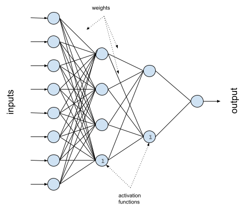

---
layout: post
title: Breast Cancer Tumor Classification
subtitle: Is it cancer?
tags: [classification]
comments: false
---

Our third lesson is another classification problem. In the lesson, we will train a computer to be able to tell us whether or not a mass is likely to be cancerous, based on a variety of measurements of the mass. The dataset is found [here](https://archive.ics.uci.edu/dataset/17/breast+cancer+wisconsin+diagnostic).

In this classification problem, we will use an *Artificial Neural Network (ANN)*, which is the foundation of most modern ML systems. An ANN attempts to model a biological brain. Here is a diagram of a simple ANN:

The blue circles in the diagram are *neurons* or *nodes*. Each node has one or more numeric inputs and a single numeric output. A node takes all of its inputs and applies some *activation function* to them, and based on the result of that function sends out some number as its output. The nodes are arranged in *layers*: an *input layer* which takes in the feature data, and *output layer* that presents the model's prediction, and usually some *hidden layers* in between. The lines between the layers show the connectedness of the network, i.e., they show where the outputs of each node go. Each connection in the internal part of the network is *weighted*, multiplied by some value, before it becomes part of the input to the next node. When the model is trained, the computer learns what weights to apply to all of those links in order for the ANN to make valid predictions. 

Like all of the lessons in the workshop, the instruction and the Python code for the lesson are all contained in a single [Google Colaboratory](https://colab.research.google.com/) Jupyter notebook. In order to use these lessons, you will need a Google account. 

To access the lesson, do the following:

1. [Click here](https://colab.research.google.com/drive/1-IPYH01VYiDYbrqN-y64M8MWDV2hXS3i?usp=sharing){:target="_blank"} to open a new tab containing the lesson's Jupyter notebook.

2. If necessary, click on the "Sign In" button to log in to your Google account. 

3. Read the introductory text in the lesson, and follow the instructions in the notebook.